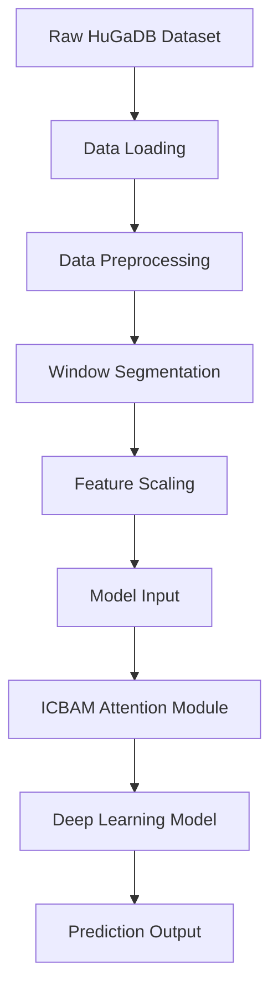
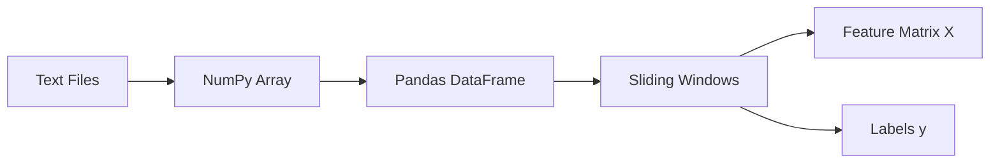
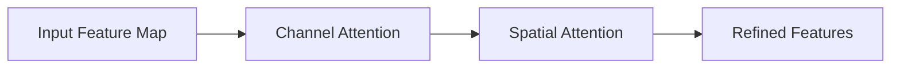
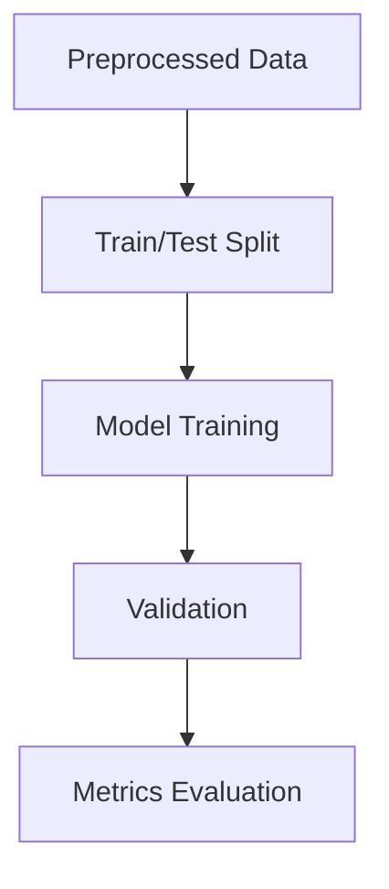
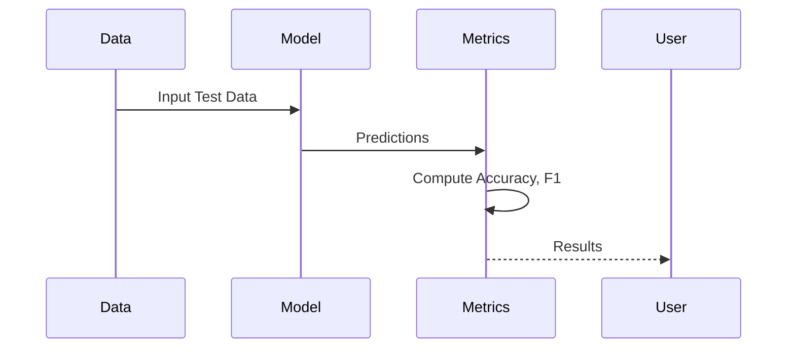

# 🧠 Pathological Gait & Activity Recognition

🚀 A Deep Learning-based system for recognizing **pathological gait patterns** and **human activities** using sensor data.  
Built with **TensorFlow, NumPy, and Scikit-learn**, enhanced by attention mechanisms for better feature learning.

---

## 📌 Overview

This project processes time-series sensor data (HuGaDB dataset), extracts meaningful features using sliding windows, and applies a **deep neural network with attention modules** to classify gait patterns and activities.

---

## 🏗️ Project Architecture



---

## ⚙️ Tech Stack

| Category            | Tools / Libraries |
|--------------------|------------------|
| Programming        | Python 🐍 |
| ML Framework       | TensorFlow / Keras |
| Data Processing    | NumPy, Pandas |
| Visualization      | Matplotlib, Seaborn |
| ML Utilities       | Scikit-learn |

---

## 📂 Dataset

- 📊 **HuGaDB (Human Gait Database)**
- Contains:
  - Sensor readings
  - Activity labels
  - Time-series motion data

---

## 🔄 Data Pipeline



---

## 🧹 Data Preprocessing Steps

- Load `.txt` files  
- Convert to NumPy arrays  
- Merge into Pandas DataFrame  
- Apply:
  - Standardization  
  - Label Encoding  
  - Window Segmentation  

---

## 🧠 Model Architecture

### 🔷 ICBAM (Improved Convolutional Block Attention Module)



### 🔍 Key Features

- Channel Attention (focus on **important features**)  
- Spatial Attention (focus on **important time steps**)  
- Enhances model performance on time-series data  

---

## 📊 Training Pipeline



---

## 📈 Evaluation Metrics

| Metric        | Description |
|--------------|------------|
| Accuracy     | Overall correctness |
| Precision    | Correct positive predictions |
| Recall       | Coverage of actual positives |
| F1 Score     | Balance of precision & recall |

---

## 📉 Performance Visualization

- 📊 Loss vs Epochs  
- 📈 Accuracy vs Epochs  
- 🔲 Confusion Matrix  
- 📋 Classification Report  

---

## 🧪 Model Evaluation Flow



---

## 🚀 How to Run

```bash
# Clone repository
git clone <your-repo-link>

# Install dependencies
pip install -r requirements.txt

# Run notebook
jupyter notebook
```

---

## 📁 Project Structure

```bash
├── data/
│   ├── HuGaDB files
├── notebooks/
│   └── Pathological_Gait_&_Activity_Recognition.ipynb
├── models/
├── outputs/
├── README.md
```

---

## 💡 Key Highlights

✨ Sliding window-based time-series modeling  
✨ Attention mechanism (ICBAM)  
✨ End-to-end ML pipeline  
✨ Clean evaluation metrics  

---

## 📌 Future Improvements

- 🔄 Real-time gait detection  
- 📱 Mobile deployment  
- 🧠 Transformer-based models  
- 📊 Larger datasets  

---

## 👨‍💻 Author

**Sparsh Gupta**

---

## ⭐ If you like this project

Give it a ⭐ on GitHub and share it 🚀

---
